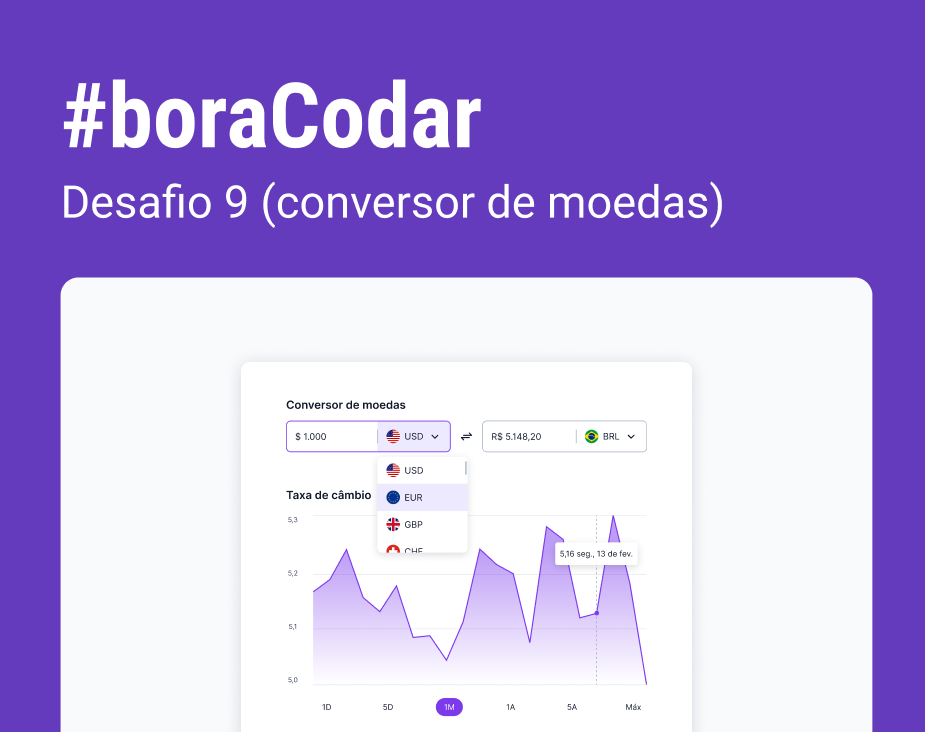
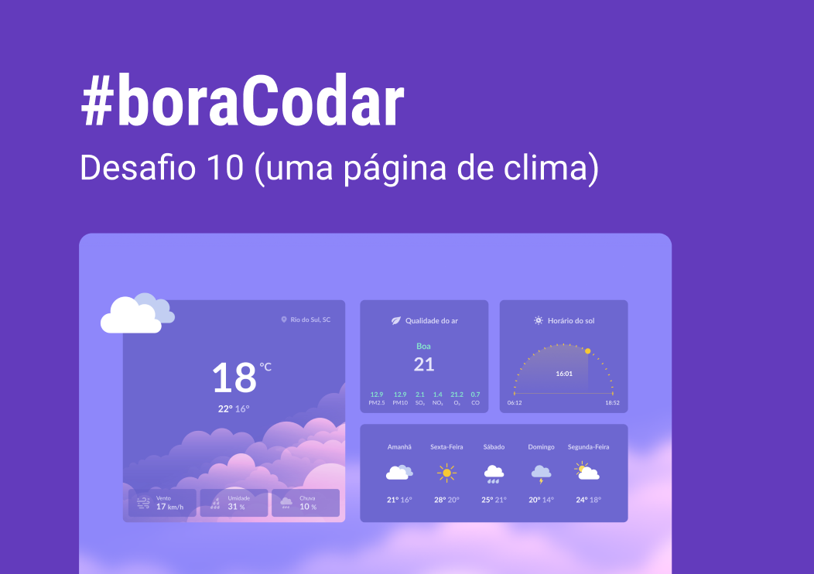
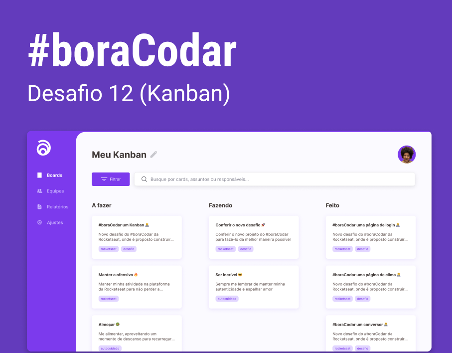

<h1 align="center"><strong>#boraCodar</strong></h1>

Repositório para armazenar os desafios semanais do #boraCodar  propostos pela Rocketseat. 🚀 

 

    <h3 align="center"><strong>DESAFIOS FEITOS</strong></h3>
    
<a href="https://boracodar.dev">Acesse o desafio desta semana clicando aqui</a> 

     <table align="center">
    <thead >
        <tr>
            <th align="center">
                
                

                    <small>#</small>
                

            </th>
            <th align="center">
                
                

                    <small>
                        NAME
                    </small>
                

            </th>
            <th align="center">
                
                

                    <small>
                    PREVIEW
                    </small>
                

            </th>
        </tr>
    </thead>
    <tbody>
        <tr>
            <td><strong>07</strong></td>
            <td><a href="https://github.com/viniciusarashiro/bora-codar/tree/main/07"><strong>Site para encontrar seu bloco no carnaval</strong></a></td>
            <td align="center" ></td>
        </tr>
        <tr>
            <td><strong>08</strong></td>
            <td><a href="https://github.com/viniciusarashiro/bora-codar/tree/main/08"><strong>Dashboard de Vendas</strong></a></td>
            <td align="center" ></td>
        </tr>
        <tr>
            <td><strong>09</strong></td>
            <td><a href="https://github.com/viniciusarashiro/bora-codar/tree/main/09"><strong>Conversor de Moedas</strong></a></td>
            <td align="center" ></td>
        </tr>
        <tr>
            <td><strong>10</strong></td>
            <td><a href="https://github.com/viniciusarashiro/bora-codar/tree/main/10"><strong>Página de Clima</strong></a></td>
            <td align="center" ></td>
        </tr>
        <tr>
            <td><strong>11</strong></td>
            <td><a href="https://github.com/viniciusarashiro/bora-codar/tree/main/11"><strong>Página de Login</strong></a></td>
            <td align="center" ></td>
        </tr>
        <tr>
            <td><strong>12</strong></td>
            <td><a href="https://github.com/viniciusarashiro/bora-codar/tree/main/12"><strong>Kanban</strong></a></td>
            <td align="center" ></td>
        </tr>
        <tr>
            <td><strong>13</strong></td>
            <td><a href="#"><strong>Forms de Cartão de Crédito</strong></a></td>
            <td align="center" ></td>
        </tr>
    </tbody>
</table>

